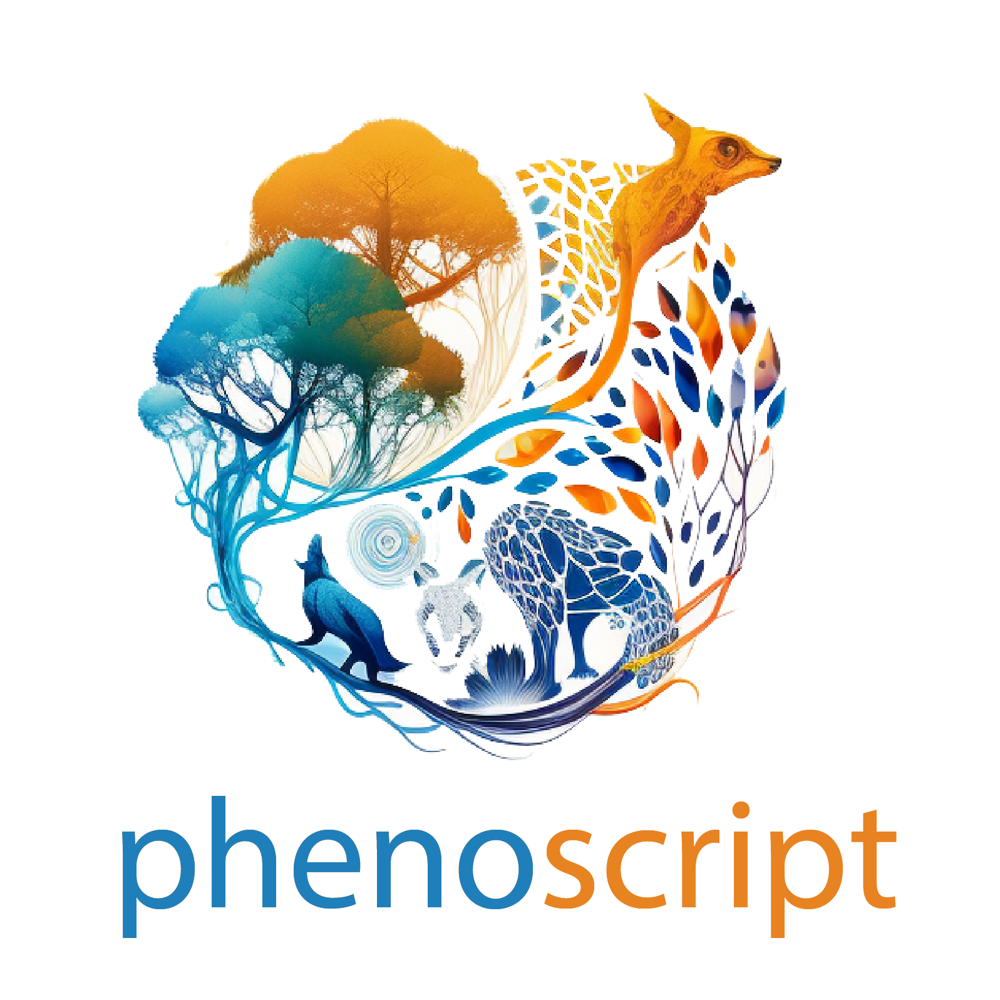

  
  &nbsp;&nbsp;&nbsp;
  

# Workshop 

# From Species Descriptions to Computable Phenotypes: An Introduction to Phenoscript and Ontologies

30 June 2026, 12:00 GMT/UTC

> 3-hour online workshop

---

## Materials

Full course materials  are available on the **[Workshop Wiki](https://github.com/sergeitarasov/whs-phenoscript-2026/wiki)**.

## Schedule

| Day | Date | Topic | Time (Brasília, BRT) | Time (Helsinki, EEST) |
|-----|------|-------|----------------------|-----------------------|
| 1 | Tuesday, May 19 | Introduction to Ontologies & Phenoscript | 09:00–12:00 | 15:00–18:00 |
| 2 | Wednesday, May 20 | Making Semantic Descriptions & Discussion | 09:00–12:00 | 15:00–18:00 |
| 3 | Thursday, May 21 | Making & Querying Semantic Descriptions | 09:00–12:00 | 15:00–18:00 |

## Prerequisites

This should be done before the course:

- Select a textual description (preferable a published one) of a species that you would like to represent using Phenoscript during the course, and have it available with you.
- Install [VS Code](https://code.visualstudio.com) (for writing Phenoscript), [Docker](https://www.docker.com/products/docker-desktop/) (to run the necessary software), and [Protégé](https://protege.stanford.edu) (ontology editor). All of them are free.
- Get [ORCID ID](https://orcid.org) if you do not have one. 
- Join the Slack channel for discussion (link privately shared)
- Highly recommended: complete the [Pizza Ontology tutorial](https://www.michaeldebellis.com/post/new-protege-pizza-tutorial) to understand what an ontology is (it takes ca. 1/2 day)
- Important Reading:
    - Insect Anatomy Ontology — <https://doi.org/10.1093/sysbio/syad025>
    - Phenoscript and semantic descriptions — <https://bdj.pensoft.net/article/121562/>

- Workshop materials will be available on [here](https://github.com/sergeitarasov/phenoscript-workshop-incol-2026)

## Organizers

- [Willi Hennig Society](https://cladistics.org/)
- Amrita Srivathsan (WHS)
- Santiago Catalano (WHS)
- Ambrosio Torres Galvis (WHS)

## Instructors

- [Sergei Tarasov](https://www.tarasovlab.com/team) (Finnish Museum of Natural History )
- [Giulio Montanaro](https://www.researchgate.net/profile/Giulio-Montanaro) (Finnish Museum of Natural History )
- [Jennifer Girón](https://sites.google.com/view/jcgiron/home) (Museum at Texas Tech University)

## Funding
Research Council of Finland (361983) to ST.
