<div style="display:flex; align-items:center; justify-content:space-between; height:80%; gap:2rem">
<div style="flex:1">

<!-- Presentation begins -->

# Annotation Guide to Write Phenoscript Descriptions

**Giulio Montanaro**

[Tarasov Lab](https://www.tarasovlab.com/)


---

# Introduction

Phenoscript uses **Entity-Quality (EQ) syntax** as the foundation for all phenotypic statements, allowing precise description of morphological traits through ontologies. 

This approach builds upon previous standardized frameworks, such as those documented in the [Phenoscape Character Annotation Guide](https://wiki.phenoscape.org/wiki/Guide_to_Character_Annotation). 


---


## Semantic Statements

In the **Entity–Quality (EQ)** model, a morphological trait is expressed as a **structure** linked to a **quality**.

It is convenient to think of them as graphs — **Knowledge Graphs**.

```py
# Fore leg is red
aism-fore_leg .ro-has_characteristic pato-red;
```


---


## Nodes: `N`

Three node types:

| Type | Description | Example |
|------|-------------|---------|
| **Class node** | Maps to an ontology class → creates an OWL individual | `uberon-male_organism` |
| **Integer node** | Whole number (counts) | `2` |
| **Real node** | Decimal number (measurements) | `2.0` |
| **String node** | Free text in quotes | `'Helictopleurus sicardi'` |

```py
uberon-male_organism .rdfs-label 'Helictopleurus sicardi';
uberon-male_organism .iao-has_measurement_value 2.0;
```

---

## Edges: `.E`

Three edge types corresponding to OWL property types:

| Type | Abbreviation | Connects | Participates in reasoning? |
|------|-------------|----------|--------------------|
| Object property | **OP** | class → class | ✅ |
| Data property | **DP** | class → string or number | ✅ |
| Annotation property | **AP** | any → any | ❌ |

VS Code snippets label each edge as **(OP)**, **(DP)**, or **(AP)**.

```py
uberon-male_organism .ro-has_characteristic pato-red; -- OP
uberon-male_organism .rdfs-label 'Helictopleurus sicardi';   -- AP
uberon-male_organism .iao-has_measurement_value 2.0;          -- DP
```

<div class="note">Phenoscript does <strong>not</strong> enforce correct edge usage — care is required.</div>

---


## Semantic Statements — Rules

**Rules:**
- Edges start with a dot `.` — inserted automatically when selecting a snippet
- Each statement must **begin and end with a node**
- Statements can be as long as needed
- Every statement must end with a **semicolon** `;`

```py
# Correct — ends with a node
N .E N .E N;

# Incorrect — ends with an edge
N .E N .E;
```

**Comments** are marked with `#` and are ignored by the converter.

---

# Core concepts: three ontology objects

- **Entity**: something that can be referred to as a distinct thing
  - **Material**: protibia, anterior region, etc. 
  - **Immaterial**: anatomical line, body axis, etc.

- **Quality**: an intrinsic feature of an entity
  - **Value**: observable traits (*e.g.*, "red", "curved")
  - **Relational**: relationship between entities (*e.g.*, "distal to", "fused with")

- **Relationship**: connects entities or qualities
  - *e.g.*, `part_of`, `has_characteristic`, `encircles`

---

# Prefixes

Ontology terms are written with their prefixes (`aism-`, `pato-`, `ro-`), which identify the source ontology. Descriptions typically draw on more than a dozen ontologies.


✓ Correct:
- pato-red, aism-insect_head, bspo-lateral_region

✗ Incorrect:
- red, aism-insect_head, bspo-lateral_region

---


## Aliases for Edges

Short aliases improve readability for the most common edges:

| Alias | Property |
|-------|----------|
| `>` | `has_part` |
| `<` | `part_of` |
| `>>` | `has_characteristic` (= bearer_of) |
| `<<` | `inheres_in` |
| `->` | `encircles` |
| `<-` | `encircled_by` |
| `\|>\|` | `increased_in_magnitude_relative_to` |
| `\|<\|` | `decreased_in_magnitude_relative_to` |

```py
# A male specimen with a red fore leg:
uberon-male_organism > aism-fore_leg >> pato-red;
```

---

## Code Blocks: OTU Structure

All statements must be placed inside an **OTU** (Operational Taxonomic Unit) block.

```py
OTU = {
  DATA = {}    # specimen metadata: taxonomy, catalogue number, labels
  TRAITS = {}  # morphological trait statements
}
```

- `DATA` — who and what the specimen is
- `TRAITS` — what traits the specimen has

**Best practice:** one species per `.yphs` file, one OTU per specimen.

Use the snippet **`tmp: Insert OTU`** to insert the block template.

---

## YAML Blocks: Motivation

Expressing specimen metadata as raw Phenoscript is verbose:

```py
DATA = {
  uberon-male_organism:genus_species[this = True, linksTraits = True,
      cls = 'uberon-adult_organism', cls = 'dwc-Preserved_Specimen']
      .rdfs-label '_ORG_Genus species';
  uberon-male_organism:genus_species .dwc-Catalog_Number 'CATALOG_NUMBER';
  uberon-male_organism:genus_species .ro-has_role_in_modeling cdao-TU
      .iao-denotes taxrank-species:yml-2db3c3;
  taxrank-species:yml-2db3c3 .dwc-Taxon_ID_taxonID
      'https://www.gbif.org/species/GBIF_ID';
  taxrank-species:yml-2db3c3 .rdfs-label 'tax_Genus species';
  taxrank-species:yml-2db3c3 .phs-represents_specimen
      uberon-male_organism:genus_species;
  uberon-male_organism:genus_species .phs-represents_taxon
      taxrank-species:yml-2db3c3;
}
```

---

## YAML Blocks: Motivation (Graph)

The verbose DATA block above produces this knowledge graph:


---

## YAML Block for compactness

The same data in a YAML block (*Carabus nemoralis*, voucher `Luomus:123`):

```py
OTU = {
  DATA = {
    #>>>YAML described_species
    described_species:
        .id: carabus_nemoralis
        .rdfs-label: 'Carabus nemoralis'
        .gbif_id: 'https://www.gbif.org/species/8056040'
        .dwc-Catalog_Number:
            - 'Luomus:123'
        .is_a:
            - uberon-male_organism
            - uberon-adult_organism
            - dwc-Preserved_Specimen
    #<<<YAML
  }
  TRAITS = {
    this >> pato-red;
    this >> pato-convex;
  }
}
```
---


## YAML Block for a New Species

The same data in a YAML block (*Carabus nemoralis*, voucher `Luomus:123`):

```py
```py
#>>>YAML new_species
new_species:
    .id: genus_species
    .rdfs-label: 'Genus species'
    .zoobank_id: 'http://zoobank.org/ZOOBANK_ID'
    .dwc-Parent_Name_Usage_ID: 'https://www.gbif.org/species/GBIF_ID_of-Parent-Genus'
    .dwc-Catalog_Number:
        - 'CATALOG_NUMBER'
    .is_a:
        - uberon-male_organism
        - uberon-adult_organism
        - dwc-Preserved_Specimen
#<<<YA
```

---

## YAML Blocks: Key Points

- **`.yphs`** files support YAML blocks; **`.phs`** files do not
- Use **YPHS → PHS** (right-click) to see how the block expands
- Always add a **GBIF ID** to link the taxon to a global registry
- Snippet **`tmp: Described species`** — for known species
- Snippet **`tmp: New species`** — for species new to science (requires ZooBank ID + parent genus GBIF ID)

**The `this` keyword:**
`this` refers to the first class under `.is_a` (here: `uberon-male_organism`).
Use it in `TRAITS` instead of repeating the full node name on every line.

```py
TRAITS = {
  this >> pato-red;     # same as: uberon-male_organism:carabus_nemoralis >> pato-red;
  this >> pato-convex;
}
```

---

## Negation Operator: `!`

The `!` operator expresses the **absence** of a structure. Place it before the edge.

```py
# Protibia is absent:
uberon-male_organism:id-1 !> aism-protibia;
```

This creates an individual of class:
`uberon-male_organism AND NOT (has_part SOME aism-protibia)`

No individual is created for the absent structure — its absence means it was not observed.

<div class="note">
⚠️ Only <code>has_part</code> and <code>encircles</code> can currently be used with <code>!</code>.
Many other negations have no well-defined ontological meaning.
</div>

---

## Personalized Tags: `:`

When the same individual appears on multiple lines, use a **tag** to identify all occurrences as the same individual.

```
node:tag_name
```

Without a tag, each occurrence is treated as a **different individual** — causing logical errors.

Use the **id tag** snippet to generate a unique random tag automatically.

---

## Tags: Without vs With

<div class="columns">
<div>

**Without tag — two individuals (incorrect)**

```py
uberon-male_organism >> pato-red;
uberon-male_organism >> pato-convex;
```


</div>
<div>

**With tag — one individual (correct)**

```py
uberon-male_organism:id-1 >> pato-red;
uberon-male_organism:id-1 >> pato-convex;
```


</div>
</div>

---

## Node Lists: `(N1, N2, N3)`

A **node list** links one node to multiple targets in a single statement:

```py
N1 .E (N2, N3, N4)
```

```py
# Assign two qualities at once:
uberon-male_organism >> (pato-red, pato-convex);
```

Equivalent to writing each statement separately:

```py
uberon-male_organism:id-1 >> pato-red;
uberon-male_organism:id-1 >> pato-convex;
```

Node lists help keep descriptions concise when one structure has several qualities.

---

# Let's Write Some Descriptions!

**Exercise:** Write a description of your favourite species — fill in its taxonomy and add 1–2 trait statements. Convert it to OWL and natural language, then open the OWL file in Protégé to explore its structure.


## Tips

**Example description — Scarabaeus (Madagascar)**
Based on [doi.org/10.3897/BDJ.12.e121562](https://doi.org/10.3897/BDJ.12.e121562) — download and paste into your project:
[`scarabaeus_madagascar.yphs`](https://github.com/sergeitarasov/phenoscript-workshop-incol-2026/blob/main/examples/Scarabaeus/phenotypes/scarabaeus_madagascar.yphs)

<br>

**Ontology term lookup tables:**

| Terms | Table |
|-------|-------|
| Qualities (PATO) | [pato-qualities/table.html](https://sergeitarasov.github.io/insectKG100/ontologies/pato-qualities/table.html) |
| Insect anatomy (AISM + COLAO) | [aism-terms/table.html](https://sergeitarasov.github.io/insectKG100/ontologies/aism-terms/table.html) |


# Building phenotypic statements

**Main descriptive strategy:** identify the anatomical structure → assign the appropriate quality

**Simple composition:**
```py
this > aism-protibia;
```
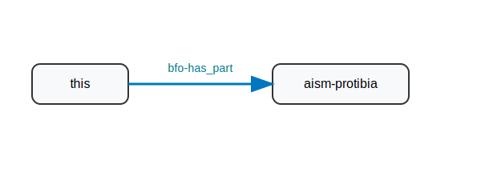

---

**Composition with quality:**
```py
this > aism-protibia >> pato-present;
```

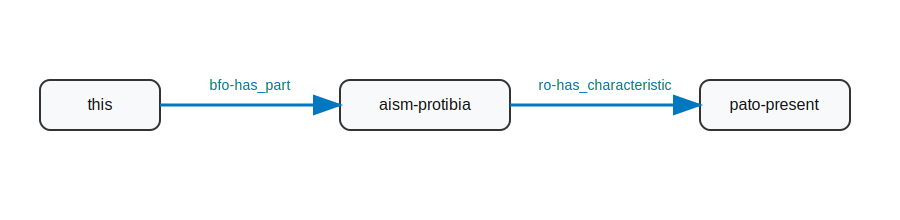

**Complete EQ statement:**
```py
this > aism-protibia >> pato-red;
```
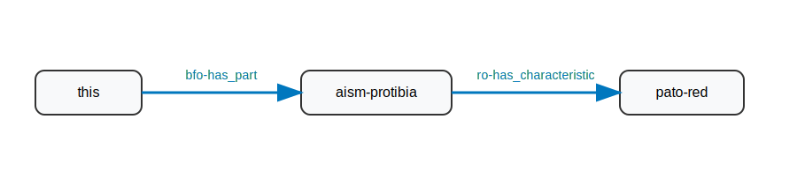

---

# Syntax & Notation

| Element | Example |
|---------|---------|
| **Entity** | `aism-protibia`, `bspo-anatomical_line` |
| **Quality** | `pato-red`, `pato-length` |
| **Relationship** | `.ro-adjacent_to`, `.phs-has_element_count` |
| **Statement** | `aism-protibia .ro-has_characteristic pato-red;` |

Prefixes are auto-generated by snippets — you don't need to look for them every time!

---

# Shortcuts: `this` and `()`

- `this` is used to reference to the specimen:
```py
this .ro-has_characteristic pato-red;
```

- parentheses are used to assign multiple entities or qualities to the same entity:

```py
# Head red, microreticulate, flattened
this > aism-insect_head >> (pato-red, aism-microreticulate, pato-flattened);
```
<center>
instead of:
</center>

```py
this > aism-insect_head:id-cd39ea >> pato-red;
aism-insect_head:id-cd39ea >> aism-microreticulate;
aism-insect_head:id-cd39ea >> pato-flattened;
```

---

# ID tags

ID tags are used to refer to the same individual multiple times:
```py
# Head red; antenna present
this > aism-insect_head:id-1954fa .ro-has_characteristic pato-red;
aism-insect_head:id-1954fa .bfo-has_part aism-antenna;
```
---

# Positional terminology

Positional terms must refer to the organism's **main body axes**, not relative axes.


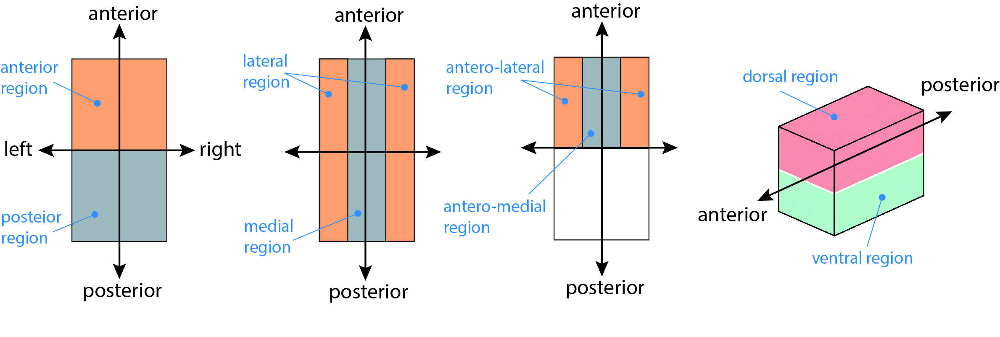


---

**Example:** In some Coleoptera, protibial teeth may appear "lateral" traditionally but are actually **dorsal** on the protibia.


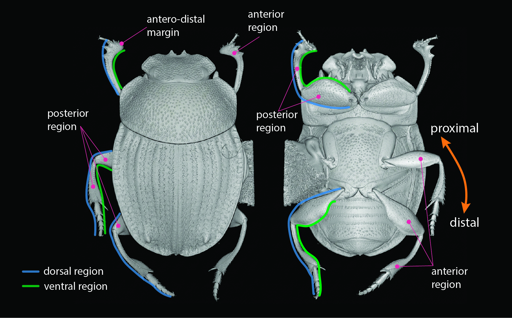


---

# Spatial terms

**Main body parts:**
- anterior, posterior region/margin
- dorsal, ventral
- lateral, medial


**Appendages:**
- anterior, posterior region/margin
- dorsal, ventral
- proximal, distal


**... and their combinations:** antero-lateral, antero-medial, ventro-proximal, etc.

⚠️ **Do NOT use** basal or apical.

---

# Composition rules: spatial terms

**Each entity uses AT MOST ONE spatial term:**

✓ Correct:
```py
# Antero-lateral region of head red
this > aism-insect_head > bspo-antero_lateral_region >> pato-red;
```

✗ Incorrect:
```py
# Antero-lateral region of head red
this > aism-insect_head > bspo-anterior_region > bspo-lateral_region >> pato-red;
```

---

# Composition rules: post-composition

Post-compose elementary anatomical structures to define more specific ones.

✓ Correct:
```py
# Protibia with spur
this > aism-protibia > aism-cuticular_spur;
# Abdomen with 7 sternites
this > aism-abdominal_sternite .has_element_count 7;
```

✗ Avoid:
```py
# Protibia with spur
this > aism-protibial_spur;
# Abdomen with 7 sternites
this > aism-abdomen_with_7_sternites;
```

---

# Main types of phenotypic statement

---

# 1. `has_part` & `part_of`

The relationship `has_part` (alias: `>`) is used to state that an **entity** is part of another **entity**:

```py
# Organism has head
this > aism-insect_head;
```

The reverse relationship `part_of` (alias: `<`) should be avoided unless strictly necessary to avoid less intelligible rendering:

```py
# Head is part of organism
aism-insect_head < this;
```

---

# 2. `has_characteristic` & `inheres_in`

The relationship `has_characteristic` (alias: `>>`) is used to state that an **entity** is characterised by some **quality**:

```py
# Head is red
this > aism-insect_head >> pato-red;
```

The reverse relationship `inheres_in` (alias: `<<`) should be avoided unless strictly necessary:

```py
# Red inheres in head
pato-red << aism-insect_head < this;
```

---

# 3. `encircles` & `encircled_by`

The relationship `encircles` (alias: `->`) is used for **ring sclerites** connected via a conjunctiva (tarsus, tibia, femur, antennomeres, **setae**, etc.):

```py
# Protibia with seta
this > aism-protibia -> aism-cuticular_seta;
```

The reverse relationship `encircled_by` (alias: `<-`) should be avoided unless strictly necessary:

```py
# Seta is encircled by protibia
aism-cuticular_seta <- aism-protibia < this;
```

---

# 4. Presence and absence

When stating that an entity `has_part` or `encircles` another entity, we are implicitly stating that the second one is present. Its **absence** can be stated by negating the `has_part` or `encircles` relationship:

```py
# Antenna absent
this !> aism-antenna;
# Protibia without cuticular seta
aism-protibia !-> aism-cuticular_seta;
```

---

Alternatively, presence or absence of structures can be stated explicitly as qualities:

```py
# Antenna present
this > aism-antenna >> pato-present;
```

```py
# Antenna absent
this > aism-antenna >> pato-absent;
```

---

# 5. Relative comparison

This pattern is used to compare the extents of two qualities, *i.e.*, if one is **larger than** or **smaller than** another. Used relationships:
- `increased_in_magnitude_relative_to` (alias: **|>|**)
- `decreased_in_magnitude_relative_to` (alias: **|<|**)

Patterns:
`'E1' >> 'Q1' |>| 'E2' >> 'Q2'` (larger than) 
and
`'E1' >> 'Q1' |>| 'E2' >> 'Q2'` (smaller than)

---

***Example:***

```py
# Protibia longer than protarsus
this > aism-protibia >> pato-length |>| pato-length << aism-protarsus < this;
```

The pattern can be generated automatically from the snippets by typing the **tmp** command and selecting it from the dropdown menu.


---

# 6. Relative measurements

Used to measure one quality using another as unit. It can be generated automatically with the **tmp** command.

```py
relative_measurement:
  .measured_trait:
    .entity: aism-protibia:id-010498
    .quality: pato-length
  .unit:
    .entity: aism-protarsus:id-538e56
    .quality: pato-length
  .value: 3
```

---

***Example:***

```py
    # Protibia 3 times as long as protarsus
    #>>>YAML relative_measurement
    relative_measurement:
      .measured_trait:
        .entity: aism-protibia:id-010498
        .quality: pato-length
      .unit:
        .entity: aism-protarsus:id-538e56
        .quality: pato-length
      .value: 3
    #<<<YAML
```


---

# 7. Absolute measurements

Allow you to provide a measurement value of a quality using standard measurement units (mm, µm, mg, etc.). Also generated through the **tmp** command.

```py
absolute_measurement:
    .measured_entity: this
    .measured_quality: pato-length
    .value: 21.5
    .unit: unit-millimeter
```

---

***Example:***

```py
    # Body length: 21.5 mm
    #>>>YAML absolute_measurement
    absolute_measurement:
        .measured_entity: this
        .measured_quality: pato-length
        .value: 21.5
        .unit: unit-millimeter
    #<<<\YAML
```

---

# 8. Element Count

States exact number of serial structures using `has_element_count` relationship:

```py
# Protarsus with 5 protarsomeres
this > aism-protarsus > aism-protarsomere .phs-has_element_count 5;
```

---

# 9. Comparison of traits between different OTUs

This comparison is done with the `exclude` command and requires to have the descriptions of both organisms within the same file.

---

```py
OTU = { # OTU: Scarabaeus viettei

  DATA = {
    #>>>YAML described_species
      described_species:
         .id: scarabaeus_viettei #OTU ID
         .rdfs-label: 'Scarabaeus viettei'
         .gbif_id: 'https://www.gbif.org/species/4997091'
         .dwc-Catalog_Number:
              - 'http://id.luomus.fi/GZ.15821'
          .is_a:
              - uberon-male_organism
              - uberon-adult_organism
              - dwc-Preserved_Specimen
      #<<<YAML
  }

  TRAITS = {
    
    # Protibia shorter than in Scarabaeus sakalava
    this > aism-protibia >> pato-length:id-111111 |<| pato-length:id-222222[exclude = TRUE];
  }
}

OTU = { # OTU: Scarabaeus sakalava

  DATA = { 
    #>>>YAML described_species
    described_species:
        .id: scarabaeus_sakalava #OTU ID
        .rdfs-label: 'Scarabaeus sakalava'
        .gbif_id: 'http://zoobank.org/7AD8F87F-E7C1-4094-BD63-7662F167E9CB'
        .dwc-Catalog_Number:
            - 'http://id.luomus.fi/GZ.15827'
        .is_a:
            - uberon-male_organism
            - uberon-adult_organism
            - dwc-Preserved_Specimen
    #<<<YAML
  }

  TRAITS = {
    
    # Protibia longer than in Scarabaeus viettei
    this > aism-protibia >> pato-length:id-222222 |>| pato-length:id-111111[exclude = TRUE];
  }
}
```


---

# 10. Other useful relationships


- `coincident_with`

```py
# Head grooved along posterior margin
this > aism-insect_head:id-56cc72 > aism-cuticular_groove .ro-coincident_with bspo-posterior_margin < aism-insect_head:id-56cc72;
```

- `medial_to`

```py
# Head with tubercle placed medially to eye
this > aism-insect_head:id-2094bf > aism-cuticular_tubercle .aism-medial_to aism-eye_cuticle < aism-insect_head:id-2094bf;
```

---

- **Fused structures**

  To say that the protibial spur is fused with the protibia, you will need to use both the **relational quality** `fused_with` and the **relationship** `towards`:

  ```py
  # Protibial spur fused with protibia
  this > aism-protibia:id-296644 > aism-cuticular_spur pato-fused_with:id-748ca8 .ro-towards aism-protibia:id-296644;
  ```

---

You may then want to specify the degree of fusion of the spur to the tibia (for example, completely/strongly fused). In this case, the quality `fused_to` is further specified as `increased_magnitude` through the relationship `has_modifier`:

```py
# Protibia and spur completely fused
this > aism-protibia:id-296644 > aism-cuticular_spur pato-fused_with:id-748ca8 .ro-towards aism-protibia:id-296644;
pato-fused_with:id-748ca8 .ro-has_modifier pato-increased_magnitude;
```

---

# Body regions and margins

- Use **region** (`bspo-anatomical_region`)
- Use **margin** (`bspo-anatomical_margin`)

⚠️ Do not use `anatomical_side`, `anatomical_surface`, `anatomical_boundary` or other variants.


- **Do NOT postcompose** regions or margins

✓ Correct:
```py
aism-protibia > bspo-ventro-distal_region;
```

✗ Wrong:
```py
aism-protibia > bspo-ventral_region > bspo-distal_region;
```

---

# Anatomical collections

In taxonomic descriptions, we often state the presence of an **unspecified** number of structures of the same kind (punctures, setae, hairs, scales, etc.). The simplest way could be using qualities such as `punctate` or `setose` but terms do not allow to characterize individual structures in further detail.

To do that, use `anatomical_collection` and, for a linear assemblage of structures, `anatomical_row`. The property `has_member` must be used when assigning entities to an anatomical collection.

```py
# Head with simple setigerous punctures
this > aism-insect_head > uberon-anatomical_collection .has_member aism-simple_setigerous_cuticular_puncture;
```

```py
#Posterior margin of head with a row of setae
this > aism-insect_head > bspo-posterior_margin > uberon-anatomical_row .has_member aism-cuticular_seta;
```

---

# Numbering serial structures

If you want to describe single structures within an ordinate series, you need to refer to their relative position within the series using the `aism-serial_position_id_X` quality. 

```py
# Dorsal margin of protibia with 4 cuticular teeth
this > aism-protibia > bspo-dorsal_margin > aism-cuticular_tooth >> aism-serial_position_id_1;
this > aism-protibia > bspo-dorsal_margin > aism-cuticular_tooth >> aism-serial_position_id_2;
this > aism-protibia > bspo-dorsal_margin > aism-cuticular_tooth >> aism-serial_position_id_3;
this > aism-protibia > bspo-dorsal_margin > aism-cuticular_tooth >> aism-serial_position_id_4;
```

---


---

# Numbering serial structures: bilateral pairs

For **bilaterally paired** structures, you don't need to specify the existence of both a left and right element. 
Use `bilaterally_paired` instead:

```py
# Anterior clypeal margin with four teeth
this > aism-clypeus > bspo-anterior_margin > aism-cuticular_tooth >> (aism-serial_position_id_1, pato-bilaterally_paired);
this > aism-clypeus > bspo-anterior_margin > aism-cuticular_tooth >> (aism-serial_position_id_2, pato-bilaterally_paired);
```

---


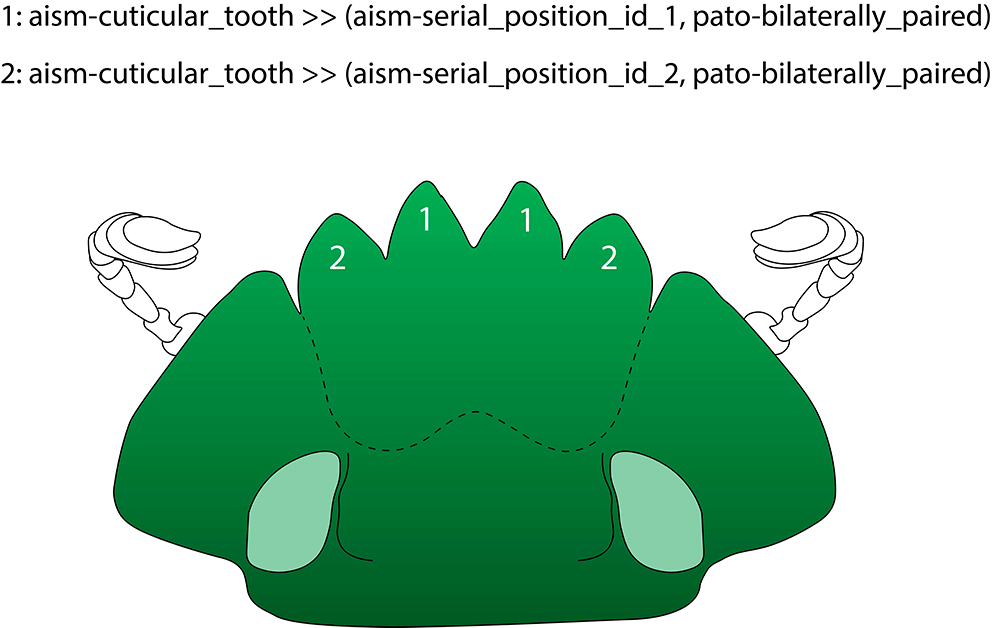


---

The position of each element relative to others can be further specified later, *e.g.*, teeth 1 are medial to teeth 2:

```py
# Anterior clypeal margin with 4 teeth, teeth 1 medial to teeth 2
this > aism-clypeus > bspo-anterior_margin > aism-cuticular_tooth:id-tooth1 >> (aism-serial_position_id_1, pato-bilaterally_paired);
this > aism-clypeus > bspo-anterior_margin > aism-cuticular_tooth:id-tooth2 >> (aism-serial_position_id_2, pato-bilaterally_paired);
aism-cuticular_tooth:id-tooth1 .aism-medial_to aism-cuticular_tooth:id-tooth2;
```

---


---

In the case of unpaired structures, the quality `unpaired` must be specified:

```py
# Anterior clypeal margin with a single tooth
this > aism-clypeus > bspo-anterior_margin > aism-cuticular_tooth >> pato-unpaired;
```

---

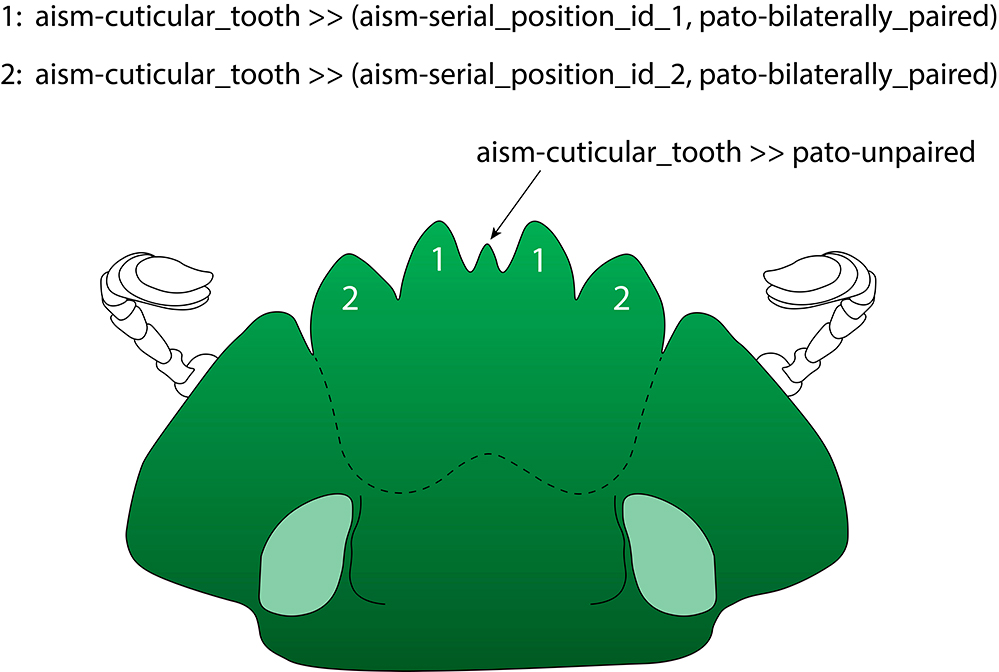

---

# Antennomeres

Antennomeres comprise scapus, pedicellus and flagellomeres:


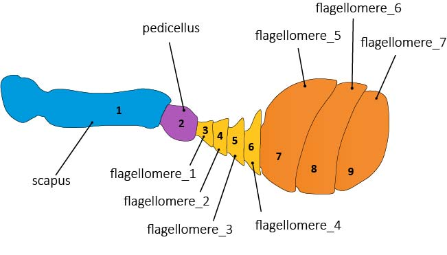


---

# Some useful shape qualities

- **`angular`**: convexly angular margins; 
  derivatives: `acutely_angular`, `obtusely_angular`, `right-angled`

- **`notched`**: concavely angular margins; 
  derivatives: `acutely_notched`, `obtusely_notched`, `emarginate`

---


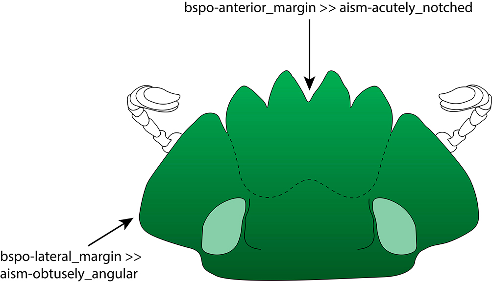

---

# Limitations

Phenoscript suits most phenotypic descriptions. However, very complex structures (intricate color patterns, genital traits) are difficult to capture and may lead to intricate, poorly understandable statements.

In those cases, providing photographs instead of a textual description may be the best solution.


Phenoscript in under active development - suggestions of additional patterns are welcome!
