<div style="display:flex; align-items:center; justify-content:space-between; height:80%; gap:2rem">
<div style="flex:1">

# Introduction to Phenoscript

**A language for semantic morphological descriptions**

<br>

INCOL 2026 Workshop

**Sergei Tarasov**
[www.tarasovlab.com](https://www.tarasovlab.com)

</div>
<div style="flex:0 0 260px; text-align:center">


</div>
</div>

---
## What Are Semantic Phenotypes?

Traditional morphological descriptions are written as **free text** — readable by humans, but opaque to machines.

**Semantic phenotypes** are descriptions linked to formal ontologies written in OWL (Web Ontology Language):

- **Controlled vocabulary:** Each term has a globally unique IRI and a definition
- **Semantics:** Relationships between terms are machine-interpretable
- **Semantics:** Terms are oganized into hierrachy (classes and sublcasses)
- **Reasonings:** Descriptions can be **reasoned over**, queried with SPARQL, and compared across studies


Phenoscript bridges the gap: you write human-friendly code; the tool generates OWL.

---


## Previous Work on Semantic Phenotypes

Semantic phenotyping has a rich history across biology:

- **Human genetics** — the Human Phenotype Ontology (HPO) encodes clinical phenotypes for disease diagnosis and gene discovery
- **Model organisms** — projects such as [Phenoscape](https://phenoscape.org) pioneered semantic phenotypes for comparative anatomy in vertebrates

**Limitation of earlier approaches:**
Previous systems used **class-based descriptions** — each phenotype is pre-defined as a named OWL class. This requires building and maintaining a curated *trait database* before any annotation can begin.

**Phenoscript's approach:**
Phenoscript uses **instance-based descriptions** — phenotypes are composed on the fly by linking ontology terms as individuals. New phenotype combinations can be expressed freely without pre-defining them, making the workflow scalable to the vast diversity of invertebrate morphology.

---

## TBox  and ABox 

OWL knowledge bases have two layers:

<div class="columns">
<div>

**TBox — Terminological Box**
Defines *classes* and their relationships using ontologies.
This is the background knowledge.



</div>
<div>

**ABox — Assertion Box**
Describes ontology instances (*individuals*) using TBox classes.
**Phenoscript generates the ABox** from your `.yphs` files.



</div>
</div>

---

## What is Phenoscript?

Phenoscript is a **domain-specific language** for writing machine-readable morphological descriptions that connect to biological ontologies.

Descriptions written in Phenoscript are:
- Based on the **Entity–Quality (EQ)** model
- Linked to terms from standard ontologies (AISM, PATO, UBERON, RO, …)
- Converted to **OWL knowledge graphs** for reasoning and querying

**File formats:**
- `.yphs` — default format mixing YAML and Phenoscript (recommended)
- `.phs` — pure Phenoscript

---


## Ontologies Used in Species Descriptions

<style scoped>table { font-size: 0.85rem; } </style>

| Abbrev | Full name | Example terms |
|--------|-----------|---------------|
| **AISM** | Ontology for the Anatomy of the Insect SkeletoMuscular system | pronotum, wing |
| **COLAO** | Coleoptera Anatomy Ontology | elytron, mesoventrite |
| **UBERON** | Uberon multi-species anatomy ontology | female organism, adult organism |
| **PATO** | Phenotype And Trait Ontology | red, convex, length, setose |
| **BSPO** | Biological Spatial Ontology | distal region, ventral side |
| **RO** | Relation Ontology | part_of, has_characteristic |
| **BCO** | Biological Collections Ontology | catalogNumber, TaxonID |
| **CDAO** | Comparative Data Analysis Ontology | TU (taxonomic unit) |
| **IAO** | Information Artifact Ontology | denotes |
| **UO** | Units of Measurement Ontology | millimeter |
| **TAXRANK** | Taxonomic Rank Vocabulary | species |
| **PHS** | Phenoscript Ontology | has_trait, OTU Block |

For details see [obofoundry.org](https://obofoundry.org).

---

# Let's Try Phenoscript!

<br>

📖 **Installation guide & Hello World** (with videos):

### [github.com/…/wiki/install](https://github.com/sergeitarasov/phenoscript-workshop-incol-2026/wiki/install)

<br>

Covers:
- Installing the VS Code extension
- Creating your first project
- Running the converter


---

## Converter: Editor Features

**Term Snippets**
As you type, all available ontology terms appear as autocomplete suggestions in a pop-up menu. Select a term to insert it.

**Ontology Term Info**
Hover over any term (e.g., `pato-red`) to see its IRI, label, and definition from the source ontology — without leaving the editor.

**Syntax Checking**
Use **Check Syntax** (sidebar button) to validate your `.yphs` file before conversion. Errors are reported with line numbers.

**YPHS → PHS Preview**
Right-click the active `.yphs` file → **YPHS → PHS** to expand YAML blocks into raw Phenoscript statements. Useful for understanding how the converter interprets your data.

---

## Output files you get

| Output | Description |
|--------|-------------|
| **OWL ABox** | Machine-readable knowledge graph (`output/abox/`) -- Open it with **Protege**. |
| **Natural language text** | HTML description auto-generated from your Phenoscript (`output/nl/`). -- You can open it with an **internet browser**. |
| **SHACL report** | SHACL (Shapes Constraint Language) validates the ABox against a set of rules — flags missing required fields and structural errors (`output/log-shacl/`) |

---

## Semantic Statements

Phenoscript uses the **Entity–Quality (EQ)** model: a morphological trait is expressed as a **structure** linked to a **quality**.

It is convenient to think of them as graphs — **Knowledge Graphs**.

```py
aism-fore_leg .ro-has_characteristic pato-red;
```



The prefixes (`aism-`, `pato-`, `ro-`) identify the source ontology. Descriptions typically draw on more than a dozen ontologies.

---

## Semantic Statements — Rules

**Rules:**
- Edges start with a dot `.` — inserted automatically when selecting a snippet
- Each statement must **begin and end with a node**
- Statements can be as long as needed
- Every statement must end with a **semicolon** `;`

```py
# Correct — ends with a node
N .E N .E N;

# Incorrect — ends with an edge
N .E N .E;
```

**Comments** are marked with `#` and are ignored by the converter.

---

## Nodes: `N`

Three node types:

| Type | Description | Example |
|------|-------------|---------|
| **Class node** | Maps to an ontology class → creates an OWL individual | `uberon-male_organism` |
| **Integer node** | Whole number (counts) | `2` |
| **Real node** | Decimal number (measurements) | `2.0` |
| **String node** | Free text in quotes | `'Helictopleurus sicardi'` |

```py
uberon-male_organism .rdfs-label 'Helictopleurus sicardi';
uberon-male_organism .iao-has_measurement_value 2.0;
```

---

## Edges: `.E`

Three edge types corresponding to OWL property types:

| Type | Abbreviation | Connects | Participates in reasoning? |
|------|-------------|----------|--------------------|
| Object property | **OP** | class → class | ✅ |
| Data property | **DP** | class → string or number | ✅ |
| Annotation property | **AP** | any → any | ❌ |

VS Code snippets label each edge as **(OP)**, **(DP)**, or **(AP)**.

```py
uberon-male_organism .ro-has_characteristic pato-red; -- OP
uberon-male_organism .rdfs-label 'Helictopleurus sicardi';   -- AP
uberon-male_organism .iao-has_measurement_value 2.0;          -- DP
```

<div class="note">Phenoscript does <strong>not</strong> enforce correct edge usage — care is required.</div>

---

## Aliases for Edges

Short aliases improve readability for the most common edges:

| Alias | Property |
|-------|----------|
| `>` | `has_part` |
| `<` | `part_of` |
| `>>` | `has_characteristic` (= bearer_of) |
| `<<` | `inheres_in` |
| `->` | `encircles` |
| `<-` | `encircled_by` |
| `\|>\|` | `increased_in_magnitude_relative_to` |
| `\|<\|` | `decreased_in_magnitude_relative_to` |

```py
# A male specimen with a red fore leg:
uberon-male_organism > aism-fore_leg >> pato-red;
```

---

## Code Blocks: OTU Structure

All statements must be placed inside an **OTU** (Operational Taxonomic Unit) block.

```py
OTU = {
  DATA = {}    # specimen metadata: taxonomy, catalogue number, labels
  TRAITS = {}  # morphological trait statements
}
```

- `DATA` — who and what the specimen is
- `TRAITS` — what traits the specimen has

**Best practice:** one species per `.yphs` file, one OTU per specimen.

Use the snippet **`tmp: Insert OTU`** to insert the block template.

---

## YAML Blocks: Motivation

Expressing specimen metadata as raw Phenoscript is verbose:

```py
DATA = {
  uberon-male_organism:genus_species[this = True, linksTraits = True,
      cls = 'uberon-adult_organism', cls = 'dwc-Preserved_Specimen']
      .rdfs-label '_ORG_Genus species';
  uberon-male_organism:genus_species .dwc-Catalog_Number 'CATALOG_NUMBER';
  uberon-male_organism:genus_species .ro-has_role_in_modeling cdao-TU
      .iao-denotes taxrank-species:yml-2db3c3;
  taxrank-species:yml-2db3c3 .dwc-Taxon_ID_taxonID
      'https://www.gbif.org/species/GBIF_ID';
  taxrank-species:yml-2db3c3 .rdfs-label 'tax_Genus species';
  taxrank-species:yml-2db3c3 .phs-represents_specimen
      uberon-male_organism:genus_species;
  uberon-male_organism:genus_species .phs-represents_taxon
      taxrank-species:yml-2db3c3;
}
```

---

## YAML Blocks: Motivation (Graph)

The verbose DATA block above produces this knowledge graph:



---

## YAML Block for compactness

The same data in a YAML block (*Carabus nemoralis*, voucher `Luomus:123`):

```py
OTU = {
  DATA = {
    #>>>YAML described_species
    described_species:
        .id: carabus_nemoralis
        .rdfs-label: 'Carabus nemoralis'
        .gbif_id: 'https://www.gbif.org/species/8056040'
        .dwc-Catalog_Number:
            - 'Luomus:123'
        .is_a:
            - uberon-male_organism
            - uberon-adult_organism
            - dwc-Preserved_Specimen
    #<<<YAML
  }
  TRAITS = {
    this >> pato-red;
    this >> pato-convex;
  }
}
```
---


## YAML Block for a New Species

The same data in a YAML block (*Carabus nemoralis*, voucher `Luomus:123`):

```py
```py
#>>>YAML new_species
new_species:
    .id: genus_species
    .rdfs-label: 'Genus species'
    .zoobank_id: 'http://zoobank.org/ZOOBANK_ID'
    .dwc-Parent_Name_Usage_ID: 'https://www.gbif.org/species/GBIF_ID_of-Parent-Genus'
    .dwc-Catalog_Number:
        - 'CATALOG_NUMBER'
    .is_a:
        - uberon-male_organism
        - uberon-adult_organism
        - dwc-Preserved_Specimen
#<<<YA
```

---

## YAML Blocks: Key Points

- **`.yphs`** files support YAML blocks; **`.phs`** files do not
- Use **YPHS → PHS** (right-click) to see how the block expands
- Always add a **GBIF ID** to link the taxon to a global registry
- Snippet **`tmp: Described species`** — for known species
- Snippet **`tmp: New species`** — for species new to science (requires ZooBank ID + parent genus GBIF ID)

**The `this` keyword:**
`this` refers to the first class under `.is_a` (here: `uberon-male_organism`).
Use it in `TRAITS` instead of repeating the full node name on every line.

```py
TRAITS = {
  this >> pato-red;     # same as: uberon-male_organism:carabus_nemoralis >> pato-red;
  this >> pato-convex;
}
```

---

## Negation Operator: `!`

The `!` operator expresses the **absence** of a structure. Place it before the edge.

```py
# Protibia is absent:
uberon-male_organism:id-1 !> aism-protibia;
```

This creates an individual of class:
`uberon-male_organism AND NOT (has_part SOME aism-protibia)`

No individual is created for the absent structure — its absence means it was not observed.

<div class="note">
⚠️ Only <code>has_part</code> and <code>encircles</code> can currently be used with <code>!</code>.
Many other negations have no well-defined ontological meaning.
</div>

---

## Personalized Tags: `:`

When the same individual appears on multiple lines, use a **tag** to identify all occurrences as the same individual.

```
node:tag_name
```

Without a tag, each occurrence is treated as a **different individual** — causing logical errors.

Use the **id tag** snippet to generate a unique random tag automatically.

---

## Tags: Without vs With

<div class="columns">
<div>

**Without tag — two individuals (incorrect)**

```py
uberon-male_organism >> pato-red;
uberon-male_organism >> pato-convex;
```


</div>
<div>

**With tag — one individual (correct)**

```py
uberon-male_organism:id-1 >> pato-red;
uberon-male_organism:id-1 >> pato-convex;
```


</div>
</div>

---

## Node Lists: `(N1, N2, N3)`

A **node list** links one node to multiple targets in a single statement:

```py
N1 .E (N2, N3, N4)
```

```py
# Assign two qualities at once:
uberon-male_organism >> (pato-red, pato-convex);
```

Equivalent to writing each statement separately:

```py
uberon-male_organism:id-1 >> pato-red;
uberon-male_organism:id-1 >> pato-convex;
```

Node lists help keep descriptions concise when one structure has several qualities.

---

# Let's Write Some Descriptions!

**Exercise:** Write a description of your favourite species — fill in its taxonomy and add 1–2 trait statements. Convert it to OWL and natural language, then open the OWL file in Protégé to explore its structure.


## Tips

**Example description — Scarabaeus (Madagascar)**
Based on [doi.org/10.3897/BDJ.12.e121562](https://doi.org/10.3897/BDJ.12.e121562) — download and paste into your project:
[`scarabaeus_madagascar.yphs`](https://github.com/sergeitarasov/phenoscript-workshop-incol-2026/blob/main/examples/Scarabaeus/phenotypes/scarabaeus_madagascar.yphs)

<br>

**Ontology term lookup tables:**

| Terms | Table |
|-------|-------|
| Qualities (PATO) | [pato-qualities/table.html](https://sergeitarasov.github.io/insectKG100/ontologies/pato-qualities/table.html) |
| Insect anatomy (AISM + COLAO) | [aism-terms/table.html](https://sergeitarasov.github.io/insectKG100/ontologies/aism-terms/table.html) |