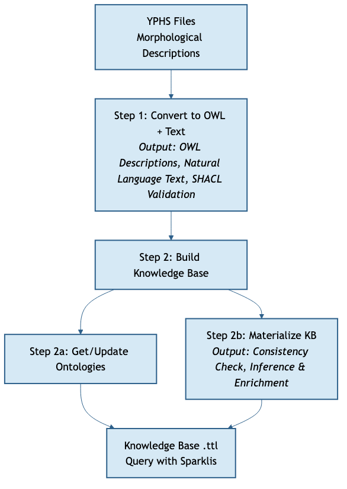

<div style="display:flex; align-items:center; justify-content:space-between; height:80%; gap:2rem">
<div style="flex:1">

# Phenoscript Workflow


<br>

WHS Methodological Pills

**Sergei Tarasov**
[www.tarasovlab.com](https://www.tarasovlab.com)

</div>
<div style="flex:0 0 230px; text-align:center">


</div>
</div>

---

# Worfklow

Install all software
1. Open VS Code and Docker should be running
1. create project. configure yaml
2. go to examplar description. Comvert to OWL text
    - Use check Syntax for troubleshootong
    - Options: Terms Info
    - Option YPHS to PHS3
    - You can convert to Text or HTML
    - You can add Gbig taxonomy
    - Good practice: one yphs per species
3. Build KB
    - Download all ontologes
    - Click Make KB

---


## Previous Work on Semantic Phenotypes

Semantic phenotyping has a rich history across biology:

- **Human genetics** — the Human Phenotype Ontology (HPO) encodes clinical phenotypes for disease diagnosis and gene discovery
- **Model organisms** — projects such as [Phenoscape](https://phenoscape.org) pioneered semantic phenotypes for comparative anatomy in vertebrates

**Limitation of earlier approaches:**
Previous systems used **class-based descriptions** — each phenotype is pre-defined as a named OWL class. This requires building and maintaining a curated *trait database* before any annotation can begin.

**Phenoscript's approach:**
Phenoscript uses **instance-based descriptions** — phenotypes are composed on the fly by linking ontology terms as individuals. New phenotype combinations can be expressed freely without pre-defining them, making the workflow scalable to the vast diversity of invertebrate morphology.

---

## TBox  and ABox 

OWL knowledge bases have two layers:

<div class="columns">
<div>

**TBox — Terminological Box**
Defines *classes* and their relationships using ontologies.
This is the background knowledge.


</div>
<div>

**ABox — Assertion Box**
Describes ontology instances (*individuals*) using TBox classes.
**Phenoscript generates the ABox** from your `.yphs` files.


</div>
</div>

---

## What is Phenoscript?

Phenoscript is a **domain-specific language** for writing machine-readable morphological descriptions that connect to biological ontologies.

Descriptions written in Phenoscript are:
- Based on the **Entity–Quality (EQ)** model
- Linked to terms from standard ontologies (AISM, PATO, UBERON, RO, …)
- Converted to **OWL knowledge graphs** for reasoning and querying

**File formats:**
- `.yphs` — default format mixing YAML and Phenoscript (recommended)
- `.phs` — pure Phenoscript

---


## Ontologies Used in Species Descriptions

<style scoped>table { font-size: 0.85rem; } </style>

| Abbrev | Full name | Example terms |
|--------|-----------|---------------|
| **AISM** | Ontology for the Anatomy of the Insect SkeletoMuscular system | pronotum, wing |
| **COLAO** | Coleoptera Anatomy Ontology | elytron, mesoventrite |
| **UBERON** | Uberon multi-species anatomy ontology | female organism, adult organism |
| **PATO** | Phenotype And Trait Ontology | red, convex, length, setose |
| **BSPO** | Biological Spatial Ontology | distal region, ventral side |
| **RO** | Relation Ontology | part_of, has_characteristic |
| **BCO** | Biological Collections Ontology | catalogNumber, TaxonID |
| **CDAO** | Comparative Data Analysis Ontology | TU (taxonomic unit) |
| **IAO** | Information Artifact Ontology | denotes |
| **UO** | Units of Measurement Ontology | millimeter |
| **TAXRANK** | Taxonomic Rank Vocabulary | species |
| **PHS** | Phenoscript Ontology | has_trait, OTU Block |

For details see [obofoundry.org](https://obofoundry.org).

---

# Let's Try Phenoscript!

<br>

📖 **Installation guide & Hello World** (with videos):

### [github.com/…/wiki/install](https://github.com/sergeitarasov/phenoscript-workshop-incol-2026/wiki/install)

<br>

Covers:
- Installing the VS Code extension
- Creating your first project
- Running the converter


---

## Converter: Editor Features

**Term Snippets**
As you type, all available ontology terms appear as autocomplete suggestions in a pop-up menu. Select a term to insert it.

**Ontology Term Info**
Hover over any term (e.g., `pato-red`) to see its IRI, label, and definition from the source ontology — without leaving the editor.

**Syntax Checking**
Use **Check Syntax** (sidebar button) to validate your `.yphs` file before conversion. Errors are reported with line numbers.

**YPHS → PHS Preview**
Right-click the active `.yphs` file → **YPHS → PHS** to expand YAML blocks into raw Phenoscript statements. Useful for understanding how the converter interprets your data.

---

## Output files you get

| Output | Description |
|--------|-------------|
| **OWL ABox** | Machine-readable knowledge graph (`output/abox/`) -- Open it with **Protege**. |
| **Natural language text** | HTML description auto-generated from your Phenoscript (`output/nl/`). -- You can open it with an **internet browser**. |
| **SHACL report** | SHACL (Shapes Constraint Language) validates the ABox against a set of rules — flags missing required fields and structural errors (`output/log-shacl/`) |

---

# Overview — Phenoscript Workflow

<div style="text-align:center; margin-top:1rem;">



</div>

---
# RECAP: Step 1 — Convert to OWL + Text

Click **Convert to OWL + Text** in the sidebar.

Converts `.yphs` files to OWL and auto-generates human-readable text, enriched with GBIF taxonomy.

| Output | Folder | Notes |
|--------|--------|-------|
| OWL files | `output/owl_init/` | One `.owl` per `.yphs` — the semantic descriptions |
| Natural language | `output/nl/` | HTML/Markdown auto-generated text |
| SHACL log | `output/log-shacl/` | Must contain `Conforms` — checks graph structure |

<div class="note">
<strong>SHACL</strong> validates the structure of your knowledge graph (e.g., that the taxonomy is properly formed). If the log says <code>Conforms</code>, all is well.
</div>

---
# Step 2: Build Knowledge Base (KB)
## Step 2a — Get / Update Ontologies

Click **Get / Update Ontologies** in the sidebar.

<br>

- Downloads all ontologies listed in `phs-config.yaml`
- Places them in `source_ontologies/`
- Merges them into a single **`tbox.owl`** file (the background knowledge)

<br>

> **Do this once per project.** Only repeat it if ontologies are updated with new terms during your project.

---
# Step 2: Build Knowledge Base (KB)
## Step 2b — Make (OWL → KB)

Click **Make (OWL → KB)** in the sidebar.

<br>

This step:
1. Merges all OWL descriptions from `output/owl_init/` with `tbox.owl`
2. Runs the **[Whelk reasoner](https://github.com/INCATools/whelk)**
3. Produces the final knowledge base: `output/kb/<projectname>-kb.ttl`

<br>

If successful, the output panel prints:

```
Success: your dataset is consistent
```

<div class="note">
⚠️ You must see <strong>"Success: your dataset is consistent"</strong> before proceeding. Inconsistent descriptions cannot be queried reliably.
</div>

---

# What the Reasoner Does — 1: Consistency Check

The reasoner verifies that all statements follow the rules defined by the ontologies.

**Most common mistake — wrong edge:**

```py
# Incorrect — a quality cannot be a part of a structure
aism-insect_head > pato-red;

# Correct — a quality must be a characteristic of a structure
aism-insect_head >> pato-red;
```

`pato-red` is a *quality*. It cannot be a *part* (`>`) of an anatomical entity — it must be a *characteristic* (`>>`). The reasoner will catch this and report an inconsistency.

---

# What the Reasoner Does — 2: Inference

The reasoner also **infers additional relationships** not explicitly stated.

Given:
```py
this > aism-insect_head > bspo-anterior_region >> pato-red;
```

The reasoner automatically infers:

```py
# has_part is transitive → organism also has_part anterior_region
this > bspo-anterior_region;

# red is a colour → individual also belongs to the class pato-color
pato-red SubClassOf pato-color;
```

This enrichment is what makes traits **automatically queryable across all descriptions**.

---

# Debugging Inconsistencies

The reasoner does not tell you *which* statement caused the error. Two strategies:

<div class="columns">
<div>

### Option 1 — Comment Out Code

Select a block of statements and comment/uncomment using:
- **macOS:** `Cmd + /`
- **Windows/Linux:** `Ctrl + /`

Then re-run **Convert** → **Make (OWL → KB)**.
Repeat until you isolate the error.

</div>
<div>

### Option 2 — PhenoScript-GPT

Paste the problematic code into **PhenoScript-GPT** and ask it to find the error.

The GPT is trained on Phenoscript syntax and annotation rules and can often pinpoint the problem quickly.

</div>
</div>

---
