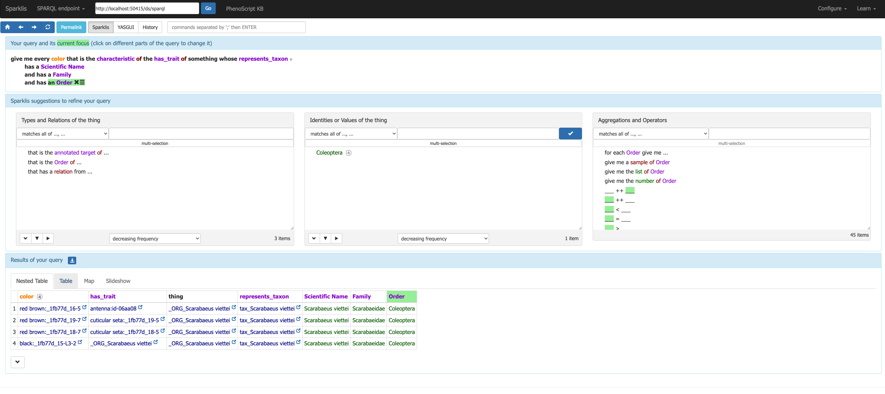
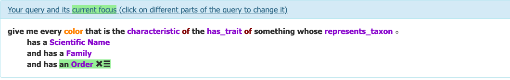

# Querying Phenoscript Descriptions 

 

WHS Methodological Pills

**Sergei Tarasov**
[www.tarasovlab.com](https://www.tarasovlab.com)

---

# PhenoScript-GPT

👉 [chatgpt.com/g/…/phenoscript-gpt](https://chatgpt.com/g/g-69d8e94a33e88191ac4dc13189a27606-phenoscript-gpt)

A custom GPT trained on Phenoscript syntax, ontology rules, and the Annotation Guide.

- **Translate** a textual description into Phenoscript
- **Suggest** ontology terms for structures and qualities
- **Debug** inconsistencies — paste your Phenoscript and ask what is wrong

⚠️ Like all LLMs, it can occasionally hallucinate ontology terms.

---

# Querying Descriptions — Sparklis

Once the knowledge base is built, query it with **Sparklis** — a visual SPARQL interface that requires no SPARQL knowledge.

**To open:** right-click `output/kb/<projectname>-kb.ttl` → **Phenoscript: Browse with Sparklis**

 

---

# Sparklis — Example Query

Query: *"Show all coloured body parts and the species they belong to"*

 

📎 [Sparklis example queries](https://www.irisa.fr/LIS/ferre/sparklis/examples.html)

---

# Step 3 — Submit *(Experimental)*

Once SHACL says `Conforms` and the reasoner says `Success`, click **Prepare for Submission**.

The extension checks both conditions and creates a `.zip` in `submit/` containing all `.yphs` files and `phs-config.yaml`.

 

### How to Submit

> ⚠️ Submitted data will be **publicly accessible**.

1. Name your file: `<FamilyName>_<SurnameInitial>.zip` — e.g., `Scarabaeinae_SmithA.zip`
2. Upload via the **[Submission Form](https://docs.google.com/forms/d/e/1FAIpQLScARO6AdiNZu7Uh_dM0XVwEYuxwwRA8hviEH4UJ1fERjkZPkA/viewform)**

Your file will be uploaded to **[insectKG100](https://github.com/sergeitarasov/insectKG100-repo)**, where the full pipeline will run automatically across all submitted descriptions.

