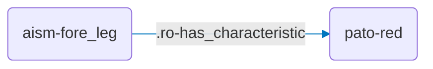
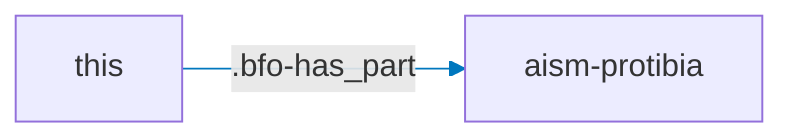
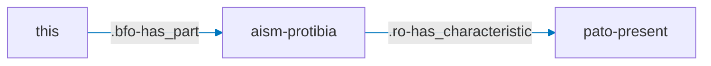
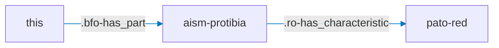
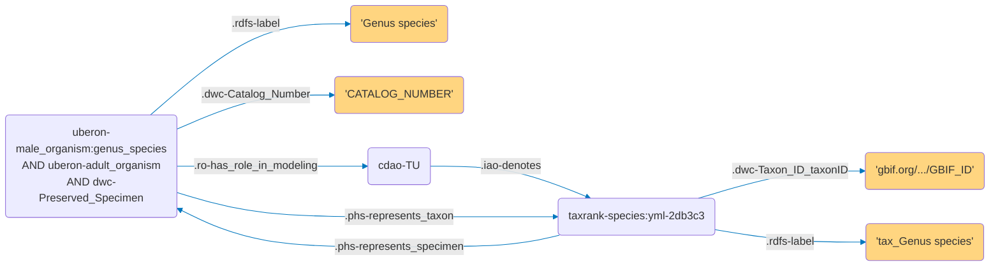

# Annotation Guide

## Introduction

This guide explains the best practice to write phenotypic statements in Phenoscript. Phenoscript uses Entity-Quality (EQ) syntax as the foundation for all phenotypic statements, allowing precise description of morphological traits through ontologies. This approach builds upon previous standardized frameworks, such as those documented in the [Phenoscape Character Annotation Guide](https://wiki.phenoscape.org/wiki/Guide_to_Character_Annotation). It provides explanation of general Phenoscript syntax, main character patterns and how to use positional and anatomical terminology in the most proper and consistent way.

-------------

## Semantic Statements as Graphs

Phenoscript is based on the **Entity–Quality (EQ) syntax**: an *entity* represents an anatomical structure (e.g., fore tibia) and a *quality* describes a property of that structure (e.g., red). Together, they form a semantic statement.

Statements are expressed as **Graphs** -- sequences of **nodes (N)** and **edges (E)**, where nodes are anatomical entities or their qualities, and edges are the relationships between them. For example, "fore leg is red" is written as:

```py
aism-fore_leg .ro-has_characteristic pato-red;
```




The prefixes (`aism-`, `pato-`, `ro-`) indicate which ontology each term comes from. Morphological descriptions typically draw on more than a dozen ontologies.

**Rules for statements:**
- Edges are indicated by a preceding dot `.` — inserted automatically when a snippet is selected.
- Each statement must begin and end with a node.
- Statements can be as long as needed.
- Every statement must end with a semicolon `;`.

```py
# Correct — ends with a node
N .E N .E N;

# Incorrect — ends with an edge
N .E N .E;
```

**Comments** are marked with `#` and are ignored by the converter. Use them to annotate your descriptions.

------


## Nodes: `N`

There are three types of nodes: **class nodes**, **numerical nodes**, and **string nodes**.

- **Class nodes** correspond to ontology classes. Selecting a snippet marked `(C)` creates a class node — Phenoscript will generate an individual belonging to that class in the output OWL file.

- **Numerical nodes** come in two subtypes:
  - *Integer* (e.g., `2`) — used for counts such as the number of digits.
  - *Real* (e.g., `2.0`) — used for measurements such as length.

- **String nodes** are enclosed in single quotes (`' '`) or double quotes (`" "`). Any text can be used.

**Example:**

```py
uberon-male_organism .rdfs-label 'Helictopleurus sicardi';
uberon-male_organism .iao-has_measurement_value 2.0;
```

Here, `uberon-male_organism` is a class node, `'Helictopleurus sicardi'` is a string node, and `2.0` is a numerical (real) node.

---

## Edges: `.E`

Edges correspond to three types of ontology properties:

| Type | Abbreviation | Connects | Used in reasoning? |
|------|-------------|----------|--------------------|
| Object property | **OP** | class node → class node | ✅ |
| Data property | **DP** | class node → string or number | ✅ |
| Annotation property | **AP** | any node → any node | ❌ |

VS Code snippets label each edge as **(OP)**, **(DP)**, or **(AP)**. Phenoscript does **not** enforce correct edge usage, so care is required.

**Example:**

```py
aism-fore_leg .ro-has_characteristic pato-red;
uberon-male_organism .rdfs-label 'Helictopleurus sicardi';
uberon-male_organism .iao-has_measurement_value 2.0;
```

In this example,  `.ro-has_characteristic` is an OP, `.rdfs-label` is an AP edge and `.iao-has_measurement_value` is a DP edge.


--------------------------------------------------------------

## Composition of Phenotypic Statements

The main strategy is to identify the specific anatomical structure that you want to describe, and then assign the appropriate quality or characteristic to it. 


- **Simple composition**: `this > aism-protibia;` (stating that protibia is part of the organism)



- **Composition with quality**: `this > protibia >> pato-present;` (stating that the protibia is present as part of the organism)



- **Complete EQ statement**: `this > protibia >> pato-red;` (stating that the protibia is red)



--------------------------------------------------------------

## Syntax and notation summary

| Element | Description | Example |
|---------|-------------|----------|
| **Entity** | Objects written with an ontology prefix | `aism-protibia`, `bspo-anatomical_line` |
| **Quality** | Characteristics written with ontology prefix | `pato-red`, `pato-length` |
| **Relationship** | Written with a period prefix and ontology prefix | `.ro-adjacent_to`, `.phs-has_element_count` |
| **Statement closure** | Each statement must end with a semicolon | `aism-protibia .ro-has_characteristic pato-red;` |

The prefixes are provided automatically by the snippets in the dropdown menu, so you don't need to remember them!

--------------------------------------------------------------

## Shortcuts: `this`
The described organism, to which all statements refer, can be referred to as `this`. For example, to say that the insect is red, you can simply write:

`this .ro-has_characteristic pato-red;`

## Shortcuts: node lists `(N1, N2, N3)`

Moreover, if multiple entities or qualities have an identical relationship with an entity, parentheses can be used to write a single statements instead of multiple ones:

```py
# Head red, microreticulate, flattened
this > aism-insect_head >> (pato-red, aism-microreticulate, pato-flattened);
```

instead of 

```py
# Head red, microreticulate, flattened
this > aism-insect_head:id-cd39ea >> pato-red;
  aism-insect_head:id-cd39ea >> aism-microreticulate;
  aism-insect_head:id-cd39ea >> pato-flattened;
```

---

## Personalized id tags

Moreover, if you want to mention the same individual structure (*e.g.*, exactly the same protibia) more than once within your description, you need to label it with a unique hexadecimal id-tag (generated automatically through the snippets dropdown menu by starting to type ":id" and pressing enter). You will need to use this tag every time you are referring to that same structure throughout the description. For example:

```py
# Head red and with antenna
this > aism-insect_head:id-1954fa .ro-has_characteristic pato-red;
aism-insect_head:id-1954fa .bfo-has_part aism-antenna;
```

After tagging a structure, you do not need to state again that the structure belongs to `this` in the following statements about it, as its existence was already declared once.


### Tags: Without vs With

<div class="columns">
<div>

Without tag — two individuals (incorrect):

```py
uberon-male_organism >> pato-red;
uberon-male_organism >> pato-convex;
```


</div>
<div>


With tag — one individual (correct):

```py
uberon-male_organism:id-1 >> pato-red;
uberon-male_organism:id-1 >> pato-convex;
```


</div>
<div>


-------------------


## Code Blocks

A complete morphological description links a specimen to its taxonomy and traits. In Phenoscript, all statements must be placed inside an **OTU (Operational Taxonomic Unit)** block. Each OTU block typically corresponds to one specimen.

An OTU block has two subblocks:
- `DATA` — specimen metadata: taxonomy, catalogue number, labels.
- `TRAITS` — trait statements describing morphological features.

```py
OTU = {
  DATA = {}   # taxonomy and specimen metadata
  TRAITS = {} # morphological trait statements
}
```

Multiple OTU blocks are allowed per file, but the recommended practice is to keep different species in **separate files** rather than in multiple OTU blocks within a single file. To insert an OTU block, use the snippet `tmp: Insert OTU`.

---

## YAML Blocks: A Shorthand for Specimen Data

Specifying full taxonomy and specimen metadata as raw Phenoscript statements can be lengthy:

```py
DATA = {
  uberon-male_organism:genus_species[this = True, linksTraits = True, cls = 'uberon-adult_organism', cls = 'dwc-Preserved_Specimen'] .rdfs-label '_ORG_Genus species';
  uberon-male_organism:genus_species .dwc-Catalog_Number 'CATALOG_NUMBER';
  uberon-male_organism:genus_species .ro-has_role_in_modeling cdao-TU .iao-denotes taxrank-species:yml-2db3c3;
  taxrank-species:yml-2db3c3 .dwc-Taxon_ID_taxonID 'https://www.gbif.org/species/GBIF_ID';
  taxrank-species:yml-2db3c3 .rdfs-label 'tax_Genus species';
  taxrank-species:yml-2db3c3 .phs-represents_specimen uberon-male_organism:genus_species;
  uberon-male_organism:genus_species .phs-represents_taxon taxrank-species:yml-2db3c3;
}
```




To simplify this, Phenoscript supports **YAML blocks** that express the same information in a compact, table-like format. The example below describes a preserved male adult specimen (*Carabus nemoralis*, voucher `Luomus:123`) that is red and oval:

```py
OTU = {
  DATA = {
    #>>>YAML described_species
    described_species:
        .id: carabus_nemoralis
        .rdfs-label: 'Carabus nemoralis'
        .gbif_id: 'https://www.gbif.org/species/8056040'
        .dwc-Catalog_Number:
            - 'Luomus:123'
        .is_a:
            - uberon-male_organism
            - uberon-adult_organism
            - dwc-Preserved_Specimen
    #<<<YAML
  }

  TRAITS = {
    this >> pato-red;
    this >> pato-convex;
  }
}
```

**Key points:**

- There are two file formats: `.yphs` (default) — a mix of YAML and Phenoscript — and `.phs` — pure Phenoscript. YAML blocks are only available in `.yphs` files.
- To see how a YAML block expands into a graph, right-click the active file and select **YPHS → PHS**.
- Always use a GBIF identifier to link your taxon to a global registry. Search for species at [gbif.org/species/search](https://www.gbif.org/species/search?q=).
- To insert template snippets for existing species, start typing `tmp` and select **Tmp: Described species**. For new species not yet in GBIF, use **Tmp: New species** (requires a ZooBank ID and a GBIF ID for the parent genus).
- The keyword `this` in `this >> pato-red` refers to the first class listed under `.is_a` — in the example above, `uberon-male_organism`. Because morphological traits always belong to a specific organism individual, `this` acts as a convenient shorthand so you do not need to repeat the full node name on every line.

**YAML block for a new species:**

```py
#>>>YAML new_species
new_species:
    .id: genus_species
    .rdfs-label: 'Genus species'
    .zoobank_id: 'http://zoobank.org/ZOOBANK_ID'
    .dwc-Parent_Name_Usage_ID: 'https://www.gbif.org/species/GBIF_ID_of-Parent-Genus'
    .dwc-Catalog_Number:
        - 'CATALOG_NUMBER'
    .is_a:
        - uberon-male_organism
        - uberon-adult_organism
        - dwc-Preserved_Specimen
#<<<YAML
```


------

## Making Entities

### Positional terminology

Positional terms must consistently refer to the main insect body axes and not the relative axis of each structure.


In some cases, the positional conventions adopted in the anatomy ontologies (and therefore in Phenoscript) may be counterintuitive for taxonomists used to traditional taxon-specific terms. For example, in some Coleoptera, legs are variously rotated around their proximo-distal axis, which led traditional family-specific terminology not to reflect the true correspondence between leg regions across all Coleoptera, *e.g.*, calling "lateral" the protibial teeth of some scarabeoid beetles which are in fact on the dorsal region of the protibia (see image below). However, in order to guarantee a consistent description of morphology across different insect families and orders the anatomically consistent positional conventions used in the ontologies must be utilized.


### Body regions and margins

To describe specific parts of an anatomical structure, the term "region" (`bspo-anatomical_region` and its derivatives) must be used. Do not use `anatomical_side`, `anatomical_surface`, or other variants. Similarly, the term "margin" (`bspo-anatomical_margin` and its derivatives) must be used to refer to the flat surface that delimit the boundary of a surface. Do not use `anatomical_boundary` or other variants.


#### Spatial terms for main body parts:
- anterior region/margin
- posterior region/margin
- lateral
- medial
- dorsal 
- ventral

And their combinations: antero-lateral, antero-medial region/margin, etc.

#### Spatial terms for appendages:
- anterior region/margin
- posterior region/margin
- dorsal 
- ventral
- proximal 
- distal

And their combinations: antero-proximal region/margin, etc.

***Important:*** Do not use alternative terms such as basal or apical.

-----

### Composition rules

Most anatomical entities are postcompositional, *i.e.*, frequently require combining spatial terms from the Biospatial Ontology (BSPO) to create precise descriptions of body structures.

Each anatomical entity should be composed with **at most one spatial term** to describe a region or margin:

***Correct:***
```py
# Anterolateral region of head is red
this > aism-insect_head > bspo-antero-lateral_region >> red;
```

***Incorrect*** **(avoid stacking spatial terms):**
```py
# Anterolateral region of head is red
this > aism-insect_head > bspo-anterior_region > bspo-lateral_region >> red;
```

Descriptions should try to maximize the use of general insect anatomical terms and combine (post-compose) them in the descriptions to characterize specific structures. For example:

***Correct***
```py
# Protibia with spur
this > aism-protibia > aism-cuticular_spur;
```

***Incorrect***
```py
# Protibia with spur
this > aism-protibial_spur;
```

Similarly:

***Correct***
```py
# Abdomen with 7 sternites
this > aism-abdominal_sternite .has_element_count 7;
```

***Incorrect***
```py
# Abdomen with 7 sternites
this > aism-abdomen_with_7_sternites;
```

---

## Main Types of Phenotypic Statement

### 1. `has_part` and `part_of`

The property `has_part` (**alias: \>**) is used to state that an **entity** is part of another **entity**:

```py
# Organism has head
this > aism-insect_head;
```

The reverse property is `part_of` (**alias: <**), which, however, should not be used unless strictly necessary to avoid a more difficultly intelligible rendering of the natural translation of the text.

```py
# Head is part of organism
aism-insect_head < this;
```


### 2. `has_characteristic` and `inheres_in`

The relationship `has_characteristic` (**alias: >>**) is used to state that an **entity** is characterised by some **quality**:

```py
# Head is red
this > aism-insect_head >> pato-red;
```

The reverse relationship `inheres_in` (**alias: <<**), which should also not be used unless strictly necessary to avoid a more difficultly intelligible rendering of the natural translation of the text.

```py
# Red inheres in head
pato-red << aism-insect_head < this;
```


### 3. `encircles` and `encircled_by`

The relationship `encircles` (alias: **->**) is used instead of has part when referring to ring sclerites that are connected to other ring sclerites via a conjunctiva. Common cases in species descriptions are **appendage sclerites** (tarsus, tibia, femur, antennomeres, etc.), as well as **setae**, which technically are separate sclerites articulated to other sclerites. For example:

```py
# Protibia with seta
this > aism-protibia -> aism-cuticular_seta;
```

The reverse relationship is `encircled_by` (alias: **<-**), which should also not be used unless strictly necessary to avoid a more difficultly intelligible rendering of the natural translation of the text.

```py
# Seta is encircled by protibia
aism-cuticular_seta <- aism-protibia < this;
```


### 4. Absence: `!`

The **absence of a structure** can be stated by negating the `has_part` or `encircles` properties with the negation operator `!`. 

```py
# Antenna absent
this !> aism-antenna;
```

```py
# Seta absent
aism-protibia !-> aism-cuticular-seta;
```


### 5. Relative comparison

The relative comparison pattern is used to compare the extents of two qualities, *i.e.*, if one is **larger than** or **smaller than** another. For this, we use the relationships `increased_in_magnitude_relative_to` (**alias: |>|**) and `decreased_in_magnitude_relative_to` (**alias: |<|**), respectively. It is expressed in the form:

`'E1' >> 'Q1' |>| 'E2' >> 'Q2'` (larger than) 
And
`'E1' >> 'Q1' |>| 'E2' >> 'Q2'` (smaller than)

The pattern can be generated automatically from the snippets by typing the **tmp** command and selecting it from the dropdown menu, then filling the different elements with the relevant entities and qualities. For example:

```py
# Protibia longer than protarsus
this > aism-protibia >> pato-length |>| pato-length << aism-protarsus < this;
```

literally meaning "length of the protibia is larger than length of the protarsus".

--------


### Summary: aliases for edges

Aliases for the most commonly used edges to improve readability:

| Alias | Property | Type of statement |
|-------|----------|-------------------|
| `>` | [has_part](http://purl.obolibrary.org/obo/BFO_0000051) | stating that an entity has part another entity |
| `<` | [part_of](http://purl.obolibrary.org/obo/BFO_0000050) | stating that an entity is part of another entity |
| `>>` | [has_characteristic (= bearer_of)](http://purl.obolibrary.org/obo/RO_0000053) | stating that an entity is bearer of a quality |
| `<<` | [inheres_in](http://purl.obolibrary.org/obo/RO_0000052) | stating that a quality inheres in an entity |
| `->` | [encircles](http://purl.obolibrary.org/obo/AISM_0000078) | stating that an entity (sclerite) encircles another entity (ring sclerite) | 
| `<-` | [encircled_by](http://purl.obolibrary.org/obo/AISM_0000079) | stating that an entity (ring sclerite) is encircled by another entity (sclerite) | 
| `\|>\|` | [increased_in_magnitude_relative_to](http://purl.obolibrary.org/obo/RO_0015007) | relative comparison (greater than) |
| `\|<\|` | [decreased_in_magnitude_relative_to](http://purl.obolibrary.org/obo/RO_0015008) | relative comparison (less than) |

---------

### 6. Relative measurements

The relative measurement pattern allows you to measure the quality of an entity using the quality of another entity as the measurement unit. The pattern can be generated automatically as a YAML block from the snippets dropdown menu by typing **tmp**, and it is expressed in the form:

```py
    relative_measurement:
      .measured_trait:
        .entity: 'E1'
        .quality: 'Q1'
      .unit:
        .entity: 'E2'
        .quality: 'Q2'
      .value: 'Val'
```

 For example, to say that the length of the protibia is 3 times the length of the protarsus:

```py
    # Protibia 3 times as long as protarsus
    #>>>YAML relative_measurement
    relative_measurement:
      .measured_trait:
        .entity: aism-protibia:id-010498
        .quality: pato-length
      .unit:
        .entity: aism-protarsus:id-538e56
        .quality: pato-length
      .value: 3
    #<<<YAML
```


### 7. Absolute measurements

The absolute measurement pattern allows you to provide a measurement value of a quality using standard measurement units (length, volume, mass, etc.). It is also generated automatically from the snippets dropdown menu by typing **tmp** and it is expressed in the form:

```py
    absolute_measurement:
        .measured_entity: 'E'
        .measured_quality: 'Q'
        .value: 'Val'
        .unit: 'Unit'
```

For example, to say that the body length of an insect is 21.5 mm:

```py
    # Body length: 21.5 mm
    #>>>YAML absolute_measurement
    absolute_measurement:
        .measured_entity: this
        .measured_quality: pato-length
        .value: 21.5
        .unit: unit-millimeter
    #<<<\YAML
```

### 8. Element count

For structures occurring in series, you may want to state their exact number. This can be done with the `has_element_count` relationship. For example:

```py
# Protarsus with 5 protarsomeres
this > aism-protarsus > aism-protarsomere .phs-has_element_count 5;
```

### 9. Comparison between different organisms

You may want to compare traits of an organism with that of another organism. To do this, you must have the descriptions of the two organisms within the same file and use the `exclude` command. 

For example, to say that the protibia of *Scarabaeus viettei* is shorter than protibia of *Scarabaeus sakalava*:

```py
OTU = { # Scarabaeus viettei

  DATA = {
    #>>>YAML described_species
      described_species:
         .id: scarabaeus_viettei #OTU ID
         .rdfs-label: 'Scarabaeus viettei'
         .gbif_id: 'https://www.gbif.org/species/4997091'
         .dwc-Catalog_Number:
              - 'http://id.luomus.fi/GZ.15821'
          .is_a:
              - uberon-male_organism
              - uberon-adult_organism
              - dwc-Preserved_Specimen
      #<<<YAML
  }

  TRAITS = {
    
    # Protibia shorter than in Scarabaeus sakalava
    this > aism-protibia >> pato-length:id-111111 |<| pato-length:id-222222[exclude = TRUE];
  }
}

OTU = { # Scarabaeus sakalava

  DATA = { 
    #>>>YAML described_species
    described_species:
        .id: scarabaeus_sakalava #OTU ID
        .rdfs-label: 'Scarabaeus sakalava'
        .gbif_id: 'http://zoobank.org/7AD8F87F-E7C1-4094-BD63-7662F167E9CB'
        .dwc-Catalog_Number:
            - 'http://id.luomus.fi/GZ.15827'
        .is_a:
            - uberon-male_organism
            - uberon-adult_organism
            - dwc-Preserved_Specimen
    #<<<YAML
  }

  TRAITS = {
    
    # Protibia longer than in Scarabaeus viettei
    this > aism-protibia >> pato-length:id-222222 |>| pato-length:id-111111[exclude = TRUE];
  }
}
```

You can refer to the OTU (=`male_organism`) within another OTU's description by using the OTU `.id` found in the data block (*e.g.*, `scarabaeus_viettei`, `scarabaeus_sakalava`). 


### 10. Other useful statements

Other relationships and qualities useful in species descriptions:

***Example 1***. To say that the head has a cuticular groove along its posterior margin, you can use the relationship `coincident_with`:

```py
# Head grooved along posterior margin
this > aism-insect_head:id-56cc72 > aism-cuticular_groove .ro-coincident_with bspo-posterior_margin < aism-insect_head:id-56cc72;
```

-------------

***Example 2***. To say that a cuticular_tubercle is placed medially (=closer to the sagittal plane) with respect to the eye, you will use the `medial_to` (make sure to use the object relationship `aism-medial_to` and not the quality `pato-medial_to`!):

```py
# Head with tubercle placed medially to eye
this > aism-insect_head:id-2094bf > aism-cuticular_tubercle .aism-medial_to aism-eye_cuticle < aism-insect_head:id-2094bf;
```

-------------

***Example 3***. If you want to say that the protibial spur is fused with the protibia, you will need to use both the **relational quality** `fused_with` and the **relationship** `towards`:

```py
# Protibial spur fused with protibia
this > aism-protibia:id-296644 > aism-cuticular_spur pato-fused_with:id-748ca8 .ro-towards aism-protibia:id-296644;
```

You may then want to specify the degree of fusion of the spur to the tibia (for example, completely/strongly fused). In this case, the quality `fused_to` is further specified as `increased_magnitude` through the relationship `has_modifier`:

```py
# Protibia and spur completely fused
pato-fused_with:id-748ca8 .ro-has_modifier pato-increased_magnitude;
```

## Punctuation and setation

In taxonomic descriptions, it is often needed to describe traits referring to the presence of an unspecified number of structures of the same kind, like punctuation, setation, etc. While the simplest way could be using qualities such as `punctate` or `setose`, these terms do not allow to characterize punctures and setae in further detail. For this reason, it is recommended to use `anatomical_collection` and, for a linear assemblage of structures, its derivative `anatomical_row`. The property `has_member` must be used when assigning entities to an anatomical collection.

***Example 1***:

```py
# Head with simple setigerous punctures
this > aism-insect_head > uberon-anatomical_collection .has_member aism-simple_setigerous_cuticular_puncture;
```

***Example 2***:
```py
#Posterior margin of head with a row of setae
this > aism-insect_head > bspo-posterior_margin > uberon-anatomical_row .has_member aism-cuticular_seta;
```

## Numbering of serial structures

Some structures with the same developmental origin are often present in series, for example cuticular spines, cuticular teeth or setae on some body margin.

If you are not interested in describing specifically single elements within the series, `has_element_count` or `uberon-anatomical_collection` will suffice (see above). However, if you want to further specify some characteristics of single serial elements, you need to refer to their relative position within the series using the `aism-serial_position_id_X` **quality**. 

***Example 1***:

```py
# Dorsal margin of protibia with 4 cuticular teeth
this > aism-protibia > bspo-dorsal_margin > aism-cuticular_tooth >> aism-serial_position_id_1;
this > aism-protibia > bspo-dorsal_margin > aism-cuticular_tooth >> aism-serial_position_id_2;
this > aism-protibia > bspo-dorsal_margin > aism-cuticular_tooth >> aism-serial_position_id_3;
this > aism-protibia > bspo-dorsal_margin > aism-cuticular_tooth >> aism-serial_position_id_4;
```


--------------

If the series of structures is present in two specular copies on the left and right body sides, it is not necessary to state the presence of both left and right copies. The structure must simply be qualified as `pato-bilaterally_paired`:

***Example 2***. Anterior clypeal margin with two pairs of specular teeth:

```py
# Anterior clypeal margin with four teeth
this > aism-clypeus > bspo-anterior_margin > aism-cuticular_tooth >> (aism-serial_position_id_1, pato-bilaterally_paired);
this > aism-clypeus > bspo-anterior_margin > aism-cuticular_tooth >> (aism-serial_position_id_2, pato-bilaterally_paired);
```


The position of each tooth relative to the others, useful to describe the order in which the elements are set, can be further specified later. For example, if, on each side, tooth 1 is medial to tooth 2: 

```py
# Anterior clypeal margin with 4 teeth, teeth 1 medial to teeth 2
this > aism-clypeus > bspo-anterior_margin > aism-cuticular_tooth:id-9e09d9 >> (aism-serial_position_id_1, pato-bilaterally_paired);
this > aism-clypeus > bspo-anterior_margin > aism-cuticular_tooth:id-1f5b66 >> (aism-serial_position_id_2, pato-bilaterally_paired);
aism-cuticular_tooth:id-9e09d9 .aism-medial_to aism-cuticular_tooth:id-1f5b66;
```

In the case of a single medial tooth, the quality `unpaired` must be specified and you do not need to number it:

```py
# Anterior clypeal margin with a single tooth
this > aism-clypeus > bspo-anterior_margin > aism-cuticular_tooth >> pato-unpaired;
```


The chosen order of numbering (what element has `id_1` and so on) will depend on conventions used within each taxon, which should be adopted consistently among authors describing species within that group.

***Note.*** In Coleoptera, elytral striae are also repeated structures with the same developmental origin; however, specific numbered terms are present for them and shall be used instead of serial position ids (*e.g.*, `colao-elytral_stria_1`, `colao-elytral_interstria_2`).

## Antennomeres

Antennomeres comprise scapus, pedicellus and flagellomeres:


## Useful shape qualities

Useful qualities that may be recurrent in the description of shapes are:

- `angular`: used to describe a convexly angular margin. The type of angle can be further specified in its derivatives such as `acutely_angular`, `obtusely_angular` and `right-angled`;
- `notched`: used to describe a concavely angular margin. The type of notch can be further specified in its derivatives such as `acutely_notched`, `obtusely_notched`, `right-angled_notched` and `emarginate`.


------

# Limitations

Phenoscript allows the description of a broad variety of phenotypic traits. However, the shape of some structures is notoriously difficult to capture even with natural language, for example some complex colour patterns or genital traits. In such cases, we suggest that the best solution is to avoid writing Phenoscript statement that may prove to be very difficult to craft and understand. Instead, complementing the taxonomic description with a self-explanatory picture of the structure is probably a much more effective solution. However, Phenoscript is constantly under development and the description of very complex structures may be easier in the future upon definition of additional ontology classes and tested descriptive patterns.

